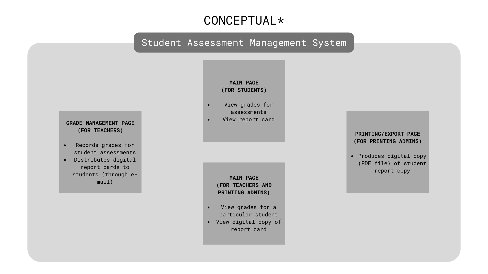

# Student Assessment Management System

A web application/system that allows students, teachers, and printing administrators to manage and view grades for the students' assessments.

## Functionality

| User           | View grades | Record grades | Distribute grades | Create/print report cards |
| -------------- | ----------- | ------------- | ----------------- | ------------------------- |
| Student        | X           |               |                   |                           |
| Teacher        | X           | X             | X                 |                           |
| Printing Admin | X           |               |                   | X                         |

## Technologies

   

**"FEVN" stack**

> -   Firestore
> -   Express
> -   Vue
> -   Node.js

## Sub-systems

## Made for

 Ateneo de Davao University Department of Electronics Engineering
